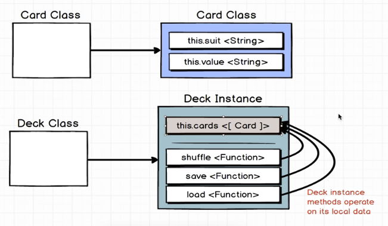
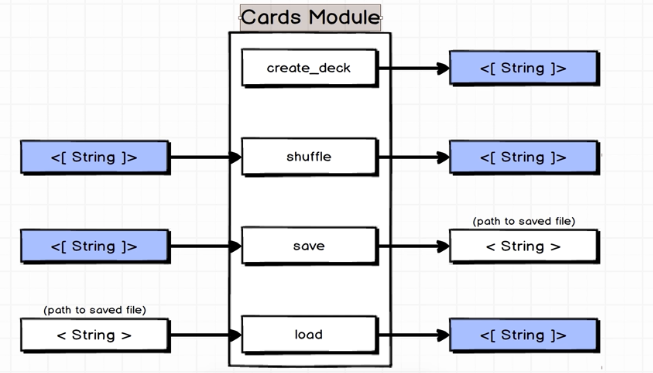
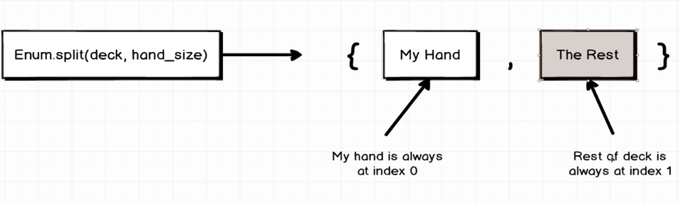

# Learning Elixir Notes

- `mix new cards` to create a new project
- `just s` to enter iex shell
- `recompile` in iex shell to recompile after changes

### Object Oriented vs Functional Programming

- Cards Object Oriented
  - Instance variables


```typescript
deck = new Deck();  // <Deck>

deck.cards;         // [Card1, Card2, Card3, ...]
deck.shuffle();     // [Card2, Card1, Card3, ...]
deck.deal();        // Deck[Card2, Card3, ...]
```

- Cards Functional
  - No concept of instance variables!



Number of arguments a funciton accepts is called its `arity`.

Immutable data structures are a core concept of functional programming. In Elixir, we have lists, tuples, maps, and structs. All of these data structures are immutable. This means that once they are created, they cannot be modified. Instead, any operation on an immutable data structure will return a new copy of that data structure with the modification applied.

- Tuples


- Pattern Matching
  - Elixir's replacement for variable assignment
  - Used any time you see the `=` operator
  - The left side of the `=` is a pattern
  - The right side of the `=` is a value


- Relationship to Erlang

Code written in Elixir is transpiled to Erlang bytecode, then is compiled and executed on the Erlang virtual machine (BEAM, conceptually similar to JVM). Elixir can be thought of as a more modern syntax for Erlang. Elixir also provides a lot of conveniences that Erlang does not, such as a package manager, a test framework, and a build tool.

- Atoms: Atoms are constants where their name is their own value. They are often used to express state, such as `:ok` or `:error`, useful for pattern matching. They are also used to reference modules, such as `:math` or `:lists`.

- Tests: Elixir comes with a built-in test framework called ExUnit. Tests are written in the test/ directory and are named with the _test.exs suffix. To run tests, use the `mix test` command. Also contains documentation tests, which are tests that are run as part of the documentation generation process.

```elixir

defmodule CardsTest do
  use ExUnit.Case

  # Setup is a special callback run before each test
  setup do
    deck = Cards.create_deck()
    {:ok, deck: deck}
  end

  # context is the state returned from setup
  test "create_deck/0", context do
    assert length(context[:deck]) == 52
  end
end
```

### Maps and Keyword Lists
Maps are key-value stores in Elixir. They are denoted by %{}.

```elixir
# Creating a map
map = %{ "name" => "John", "age" => 30 }

# Accessing values
IO.puts(map["name"])  # Outputs: "John"

# Updating a map
map = Map.put(map, "age", 31)
IO.puts(map["age"])  # Outputs: 31

# Pattern matching with maps
%{"name" => name} = map
IO.puts(name)  # Outputs: "John"
```

Keyword lists are lists of tuples where the first element of the tuple is an atom. They are denoted by [].

```elixir
# Creating a keyword list
list = [name: "John", age: 30]

# Accessing values
IO.puts(list[:name])  # Outputs: "John"

# Updating a keyword list
list = Keyword.put(list, :age, 31)
IO.puts(list[:age])  # Outputs: 31

# Pattern matching with keyword lists
[name: name] = list
IO.puts(name)  # Outputs: "John"
```
